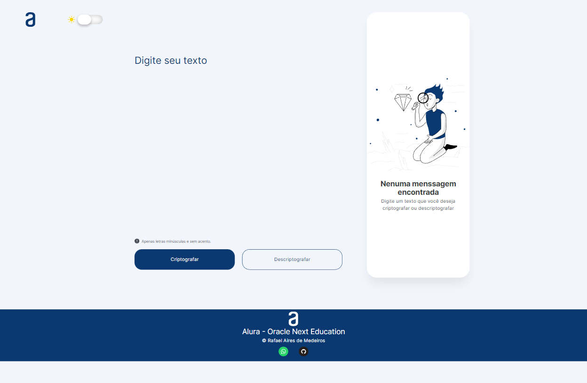

# Challenge ONE : Decodificador de Texto

## Description
I am participating in a selective test for the Alura - Oracle Next Education scholarship and this is a challenge that was passed on to me. This is a website for encrypting text.

## Link
https://rafadot.github.io/Challenge-ONE-Decodificador-de-Texto/

 

## Technologies

     
     
     
      

 

## Screens

    <h3><strong>PC</strong></h3>
    
      
    <h3><strong>PC - DARK</strong></h3>
    
      

    <h3><strong>LAPTO L</strong></h3>
    
      
    <h3><strong>LAPTO L - DARK</strong></h3>
    
      

    <h3><strong>LAPTO</strong></h3>
    
      
    <h3><strong>LAPTO - DARK</strong></h3>
    
      

    <h3><strong>TABLET</strong></h3>
    
      
    <h3><strong>TABLET - DARK</strong></h3>
    
      

    <h3><strong>MOBILE L</strong></h3>
    
      
    <h3><strong>MOBILE L - DARK</strong></h3>
    
      

    <h3><strong>MOBILE M</strong></h3>
    
      
    <h3><strong>MOBILE M - DARK</strong></h3>
    
      

    <h3><strong>MOBILE S</strong></h3>
    
      
    <h3><strong>MOBILE S - DARK</strong></h3>
    
      

